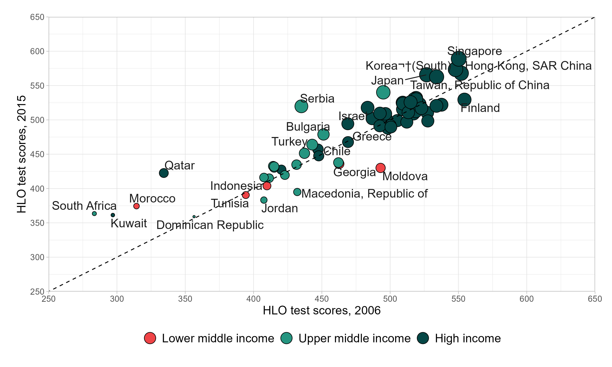

**Course Title**: Econ 106 Computer programming for economcis <br> **Instructor**: Christopher Llones <br> **Exercise**:Replicating a World Bank figure using ggplot2 <br> **Due Date**: 23 April 2026 <br> **Submission link**: [Google form submission](https://forms.gle/jFCrVJmsu4VM91Yc9)


## Objective

By the end of this exercise, students will be able to:

- Import and clean raw Excel data using readxl and janitor.
- Transform data from long to wide format with dplyr and tidyr.
- Create a bubble scatter plot in ggplot2 with customized aesthetics.
- Replicate a figure from the World Bank’s Human Capital Report.
- Interpret the visualization in terms of economic development and human capital outcomes.


## Data management

1. Download the dataset: [hlo_database.xlsx](https://datacatalog.worldbank.org/search/dataset/0038001/harmonized-learning-outcomes-hlo-database) (from the World Bank Data Catalog). You may read the full report [here](https://www.worldbank.org/en/publication/human-capital-report).

2. Install (if needed) and load the following packages

```{r}
#| eval: false
library(tidyverse)
library(janitor)
library(readxl)
library(ggrepel)
```

3. Use `read_excel()` to load the dataset from the World Bank’s Human Capital Report database. Select the correct sheet (in this case, sheet 3).

4. Apply clean_names() from the janitor package to standardize variable names (lowercase, snake_case).

5. Select and keep only the columns: `country`, `year`, `hlo_m`, and `incomegroup`. These are the needed variables for analysis.

6. Filter the dataset to the years 2006 and 2015, since these are the comparison points for the visualization.

7. Group by `incomegroup`, `country`, and `year`. Compute the average of `hlo_m` using `summarise(mean_hlo = mean(hlo_m))`. This ensures each country-year has a single representative value.

8. Reshape the dataset to wide format. Use `pivot_wider()` with `names_from = year` and `values_from = mean_hlo`. This creates two columns: one for 2006 values and one for 2015 values.

9. Remove incomplete cases by applying `na.omit()` to drop countries missing data for either year.

10. Rename the year columns to `hlo_2006` and `hlo_2015` for easier reference in plotting.

11. The final dataset should be similar with the dataset below.


```{r}
#| echo: false
#| message: false
#| warning: false

# libraries
library(tidyverse)
library(janitor)
library(readxl)
library(ggrepel)

# data management
## reading data
hlo_dta <- 
  read_excel("data/hlo_database.xlsx", 3) |> 
  clean_names() |> 
  select(country, year, hlo_m, incomegroup) |> 
  filter(year %in% c(2006, 2015)) |> 
  group_by(incomegroup, country, year) |> 
  summarise(mean_hlo = mean(hlo_m)) |> 
  ungroup() |>
  pivot_wider(
    names_from = year,
    values_from = mean_hlo
  ) |>
  na.omit() |> 
  rename(
    "hlo_2006" = `2006`,
    "hlo_2015" = `2015`
  ) |> 
 mutate(across(is.numeric, ~ round(.x, 3)))

## display data
DT::datatable(hlo_dta)

```


## Creating Bubble Plot

```{r}
#| echo: false
## display plot

```

<br>

1. Prepare the income group variable
    - Convert incomegroup into a factor and set the order of levels (High income, Upper middle income, Lower middle income).
    - This ensures the legend displays groups in a meaningful order.

2. Set up the plot structure. Use `ggplot()` with the dataset `hlo_dta`.
    - Map aesthetics: 
        - `x` = `hlo_2006` (scores in 2006)
        - `y` = `hlo_2015` (scores in 2015)
        - `size` = `hlo_2015` (bubble size reflects 2015 scores)
        - `fill` = `incomegroup` (bubble fill color shows income group).

3. Add bubbles with outlines. Use `geom_point(shape = 21, color = "black")` to draw filled circles with a black outline.

4. Add a reference line. Use `geom_abline(slope = 1, intercept = 0, linetype = "dashed")`. This diagonal line shows where 2006 and 2015 scores would be equal. Countries above the line improved; those below declined.

5. Label countries. Use `geom_text_repel(aes(label = country))` from the ggrepel package. This places country names near bubbles without overlapping.

6. Customize axes. Use `scale_x_continuous()` and `scale_y_continuous()` to set limits (250–650), tick marks every 50, and axis titles. This ensures a consistent scale for comparison.

7. Customize colors and sizes. Use `scale_fill_manual()` to assign custom colors for income groups. Use `scale_size(range = c(1, 8), guide = "none")` to control bubble size range and hide the size legend.

8. Adjust the legend. Use `guides(fill = guide_legend(override.aes = list(size = 6), reverse = TRUE))`. This enlarges legend bubbles and reverses the order for clarity.

9. Add labels and themes. Use `labs(fill = NULL)` to remove the legend title. Apply `theme_light()` for a clean background. Adjust margins, axis text, and legend position with `theme()` for readability.


```{r}
#| echo: false
#| eval: false

## plotting dataset
p <- hlo_dta %>%
  mutate(incomegroup = factor(incomegroup, levels = c("High income", "Upper middle income", "Lower middle income"))) |> 
  ggplot(aes(
    x = hlo_2006,
    y = hlo_2015,
    size = hlo_2015,    
    fill = incomegroup
  )) +
  geom_point(shape = 21, color = "black") +
  geom_abline(slope = 1, intercept = 0, linetype = "dashed") +  
  geom_text_repel(aes(label = country), size = 5, color = "gray10", seed = 2026) +
  scale_x_continuous(limits = c(250, 650), breaks = seq(250, 650, 50), expand = c(0, 0), name = "HLO test scores, 2006") +
  scale_y_continuous(limits = c(250, 650), breaks = seq(250, 650, 50), expand = c(0, 0), name = "HLO test scores, 2015") +
  scale_fill_manual(values = c("#054746", "#259580", "#ef4447")) +
  scale_size(range = c(1, 8), guide = "none") +  
  guides(fill = guide_legend(override.aes = list(size = 6), reverse = T)) +

  labs(
    fill = NULL
  ) +
  theme_light() +
  theme(
    plot.margin = margin(20, 20, 20, 20),
    axis.title = element_text(size = 14, margin = margin(t=10, r=10)),
    axis.text = element_text(size = 10),
    legend.position = "bottom",
    legend.text = element_text(size = 14)
  )

## saving plot
ggsave(
    plot = p,
    filename = "plot/hlo_plot.jpg",
    width = 10,
    height = 6,
    unit = "in",
    dpi = 300
)
```