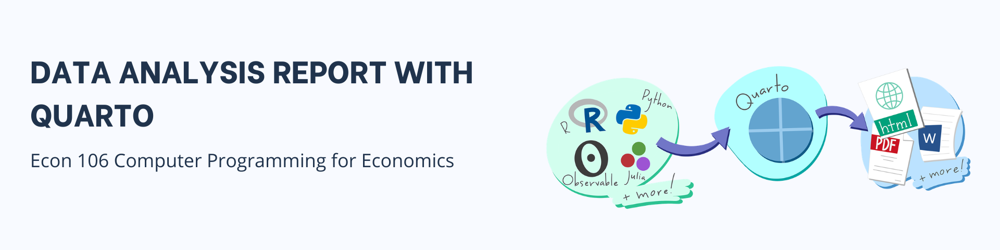

**Course Title**: Econ 106 Computer programming for economcis <br> **Instructor**: Christopher Llones <br> **Exercise**:Data analysis report with Quarto <br> **Due Date**: 20 May 2026 <br> **Submission link**: [Google form submission]()

## Objective

Practice using Quarto documents to combine text, R code, and outputs. You will analyze the Netflix Movies & TV Shows dataset using dplyr and related tidyverse tools, while learning how to structure and render a .qmd file.


## Set-up quarto document

1. Create a new Quarto document. Save it as netflix-exercise.qmd.

2. Add YAML metadata

```{r}
#| content: valuebox
#| eval: false
---
title: "Econ 106 - Module 5 Exercise"
author: "Your Name"
date: "`r Sys.Date()`"
format: html
---
```

3. Write an introduction

```{r}
#| eval: false

## Introduction

This exercise demonstrates how to use Quarto for combining narrative text, R code, and outputs.  
We will analyze the Netflix Movies & TV Shows dataset using tidyverse functions.

```

4. Load packages and dataset

```{r}
#| eval: false
library(dplyr)
library(ggplot2)
library(readr)

# Load dataset (adjust path if needed)
netflix <- read_csv("data/netflix_titles.csv")
```


## Answer the following questions with code chunks

1. List all unique types of content (e.g., Movie, TV Show).

2.  Filter the dataset to show only TV Shows released in India. How many are there?

2. What are the top 5 most common ratings.

3. Which year had the most titles added to Netflix?

4. Group the data by `type` and count how many entries each type has. Group the data by `release_year` and summarize the number of titles released per year. Which country has produced the most content on Netflix?

5. From the available columns or variables in the dataset, create a data visualization and discuss.


## Additional options for YAML

1. Try the following YAML options to control the appearance or design of your quarto report. To learn more about the different ways how to design your quarto document, you may refer to this [quarto HTML basics](https://quarto.org/docs/output-formats/html-basics.html).

```{r}
#| eval: false
---
title: "Econ 106 - Module 5 Exercise"
author: "Your Name"
date: last-modified
format: 
  html:
    self-contained: true
    toc: true
    toc-location: left
    toc-depth: 3
    number-sections: true
    code-fold: true
    theme:
      light: cosmo
      dark: darkly
editor: visual
---
```
